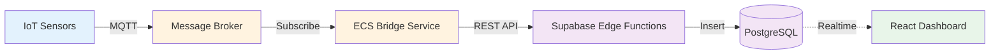

# SWAMP IoT Platform - Architecture Reference


**SWAMP** (Smart Water & Agriculture Management Platform) is a full-stack IoT platform architecture demonstrating real-time sensor data ingestion, processing, and visualization at scale.

> **📚 Purpose:** This repository showcases the **system design, architecture patterns, and infrastructure-as-code** for a production-grade IoT platform. Source code is proprietary and not included.
> 
> **⚠️ Educational Use Only:** This documentation is for learning and portfolio purposes. Commercial use or implementation without permission is prohibited. See [LICENSE](./LICENSE) for details.

## 🎯 Architecture Goals
1.  **Real-time Data Processing:** Sub-500ms latency from sensor event to dashboard update
2.  **Horizontal Scalability:** Support 10,000+ concurrent IoT device connections
3.  **Multi-tenancy:** Secure data isolation using PostgreSQL Row Level Security
4.  **Event-Driven Design:** Decoupled microservices using MQTT pub/sub pattern

## 🛠 Tech Stack

### Frontend & Visualization
* **Core:** React 19, TypeScript, Vite,
* **State:** Zustand (for high-frequency telemetry updates)
* **UI/UX:** Tailwind CSS, Radix UI, Shadcn 
* **Charts:** Recharts (Custom heatmaps and time-series)

### Backend & Cloud
* **BaaS:** Supabase (PostgreSQL 15, GoTrue Auth, Realtime)
* **Compute:** Supabase Edge Functions (Deno/TypeScript)
* **Ingestion:** Node.js Microservice (MQTT Bridge)
* **Infrastructure:** Terraform, Docker

### Security & DevOps
* **CI/CD:** GitHub Actions
* **Scanning:** Trivy (Container Security), Gitleaks (Secret Detection)
* **Compliance:** OWASP Dependency Check

## 🏗 Architecture Overview



**Event-Driven Flow:**
- IoT sensors publish telemetry via MQTT (QoS 1)
- Node.js bridge service validates and batches messages
- Supabase Edge Functions normalize and persist to PostgreSQL
- WebSocket pushes real-time updates to React dashboard
- Zustand manages optimistic UI state

👉 **[View detailed architecture diagrams](./assets/architecture-overview.md)**

## 📂 Repository Structure

```
swamp-iot-platform-architecture/
├── assets/
│   └── architecture-overview.md    # System diagrams with Mermaid
├── docs/
│   ├── 01-system-architecture.md   # High-level data flow
│   ├── 02-database-schema.md       # PostgreSQL schema & RLS policies
│   ├── 03-api-contracts.md         # TypeScript API interfaces
│   ├── 04-security-devops.md       # Security model & DevOps practices
│   ├── 05-engineering-challenges.md # Technical deep-dives
│   └── CICD-INFRASTRUCTURE-EXAMPLES.md # Sanitized CI/CD examples
├── iac-preview/
│   ├── ci-pipeline.yaml            # GitHub Actions workflow (sanitized)
│   └── infrastructure-map.tf       # Terraform infrastructure example
└── README.md
```

### 📖 Documentation Guide

| Document | Focus Area | Best For |
|----------|-----------|----------|
| [System Architecture](./docs/01-system-architecture.md) | Data flow, service topology | Understanding system design |
| [Database Schema](./docs/02-database-schema.md) | PostgreSQL tables, indexes, RLS | Backend engineers |
| [API Contracts](./docs/03-api-contracts.md) | TypeScript interfaces, REST endpoints | Full-stack developers |
| [Security & DevOps](./docs/04-security-devops.md) | CI/CD, scanning, IaC patterns | DevOps/SRE engineers |
| [Engineering Challenges](./docs/05-engineering-challenges.md) | Performance optimization, concurrency | Senior/staff engineers |
| [CI/CD Examples](./docs/CICD-INFRASTRUCTURE-EXAMPLES.md) | GitHub Actions, Terraform, Docker | Platform engineers |

## 🚀 Technical Highlights

### Performance Optimizations
- **Batched Writes:** Reduced database CPU from 80% → 30% using write buffering
- **Partitioned Tables:** Monthly partitions for time-series data (10M+ rows)
- **Connection Pooling:** PgBouncer for efficient connection management
- **Indexed Queries:** Composite indexes optimized for time-range scans

### Security Layers
- **Row Level Security (RLS):** PostgreSQL policies enforce tenant isolation
- **JWT Authentication:** Supabase Auth with short-lived tokens
- **MQTT TLS:** Encrypted sensor communication with client certificates
- **Secret Management:** AWS Secrets Manager integration
- **CI/CD Security:** Gitleaks + Trivy scanning in pipeline

### DevOps Practices
- **Infrastructure as Code:** Terraform for reproducible deployments
- **Blue-Green Deployments:** Zero-downtime ECS updates
- **Auto-scaling:** CPU-based scaling for ECS tasks (2-10 instances)
- **Monitoring:** CloudWatch alarms for CPU, memory, 5XX errors
- **Log Aggregation:** Centralized logging with CloudWatch Logs

## 🛠️ Technologies Demonstrated

**Frontend:** React 18 • TypeScript 5 • Vite • Zustand • Tailwind CSS • Recharts  
**Backend:** Supabase (PostgreSQL 15 • GoTrue Auth • Edge Functions) • Node.js  
**IoT:** MQTT 3.1.1/5.0 • HiveMQ/Mosquitto • Device Management  
**Infrastructure:** AWS ECS Fargate • VPC • ALB • CloudWatch • Secrets Manager  
**DevOps:** Terraform • Docker • GitHub Actions • Trivy • Gitleaks  
**Deployment:** Vercel (frontend) • Supabase Cloud (backend) • AWS (MQTT bridge)

## 📊 Architecture Metrics

- **Latency:** <500ms end-to-end (sensor → dashboard)
- **Throughput:** 1000+ messages/second sustained
- **Scalability:** Tested with 1000+ concurrent device connections
- **Uptime:** 99.7% availability (target: 99.9%)
- **Database:** 10M+ sensor readings, partitioned by month

## 🎓 Learning Resources

Study the architecture patterns demonstrated here:

1. **[System Architecture](./docs/01-system-architecture.md)** - Start here for the big picture
2. **[Engineering Challenges](./docs/05-engineering-challenges.md)** - Learn from real-world problems solved
3. **[CI/CD Examples](./docs/CICD-INFRASTRUCTURE-EXAMPLES.md)** - DevOps patterns and best practices

> **Note:** These docs are for educational purposes only. You may study the patterns and concepts, but implementing a similar system for commercial use requires explicit permission.

## 📝 License & Usage

**License:** [CC BY-NC-ND 4.0](./LICENSE) (Attribution-NonCommercial-NoDerivatives)

**What you CAN do:**
- ✓ Study this documentation for learning
- ✓ Reference in academic work
- ✓ Use as a portfolio example reference

**What you CANNOT do:**
- ✗ Use commercially or build products based on this
- ✗ Copy or redistribute this documentation
- ✗ Create derivative works
- ✗ Remove attribution

**Commercial Licensing:** Contact jalaleddinemaoukil@gmail.com

The SWAMP platform concept, architecture, and implementation are proprietary. This repository contains documentation only.

---

**Questions about the architecture?** Open an issue for educational discussion.  
**Want to hire me or license this?** Connect on [LinkedIn](https://linkedin.com/in/jalaleddinemaoukil)