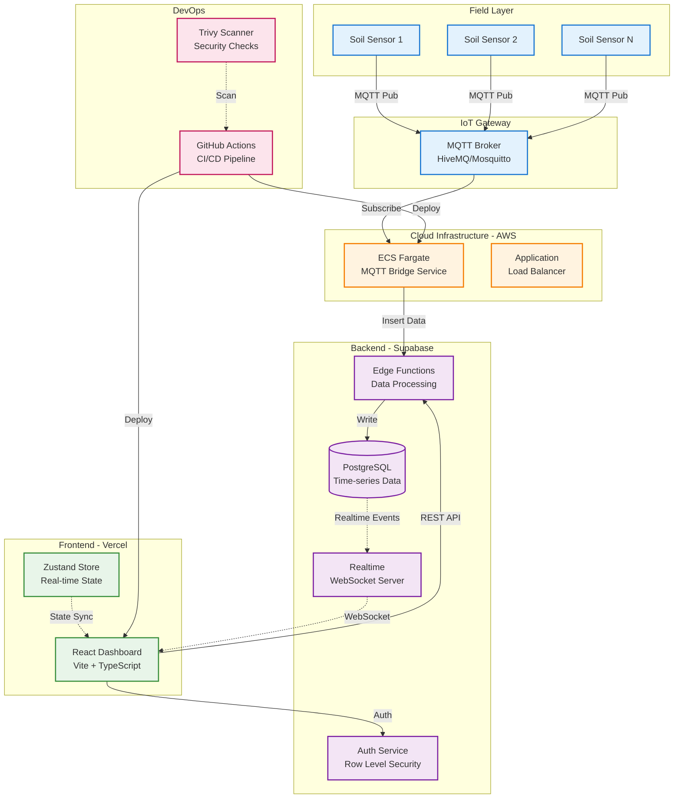
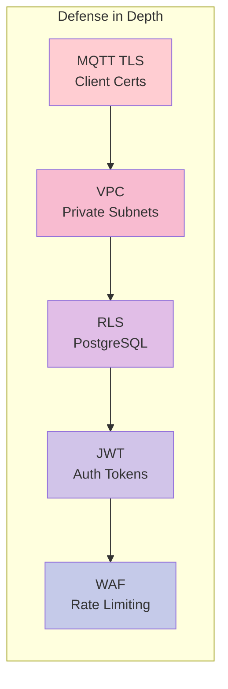

# SWAMP Platform Architecture Diagram

## High-Level System Architecture

## Data Flow Explanation

1. **Sensors** publish soil moisture, temperature, and battery data via MQTT
2. **MQTT Broker** receives high-frequency telemetry (1 message/minute per sensor)
3. **ECS Bridge Service** subscribes to topics, validates, and batches data
4. **Edge Functions** normalize data and insert into PostgreSQL with timestamp
5. **PostgreSQL** stores time-series data with partitioning by month
6. **Realtime Server** broadcasts changes to connected web clients
7. **React Dashboard** updates state in real-time using Zustand
8. **CI/CD Pipeline** deploys containerized services with security scanning

## Key Architectural Decisions

### Why MQTT?
- Lightweight protocol for IoT devices with limited bandwidth
- Pub/Sub pattern decouples sensors from backend
- Built-in QoS levels for reliable delivery

### Why Supabase?
- PostgreSQL with built-in auth and real-time capabilities
- Edge Functions eliminate need for separate Node.js API
- Row Level Security for multi-tenancy

### Why ECS Fargate?
- Serverless containers for MQTT bridge (no server management)
- Auto-scaling based on CPU/memory
- Integrates with ALB for health checks

### Why Zustand?
- Lightweight state management (3KB vs Redux 10KB+)
- No context/provider boilerplate
- Optimized for high-frequency updates

## Security Layers

## Scalability Strategy

| Component | Scaling Method | Target Capacity |
|-----------|----------------|-----------------|
| MQTT Broker | Horizontal (cluster) | 10K+ connections |
| ECS Tasks | Auto-scaling (CPU) | 2-10 tasks |
| PostgreSQL | Vertical + Read Replicas | 100K writes/min |
| Edge Functions | Automatic (Deno Deploy) | Unlimited |
| Frontend | CDN (Vercel Edge) | Global |

---

*This architecture supports 1000+ concurrent sensors with <500ms end-to-end latency*
