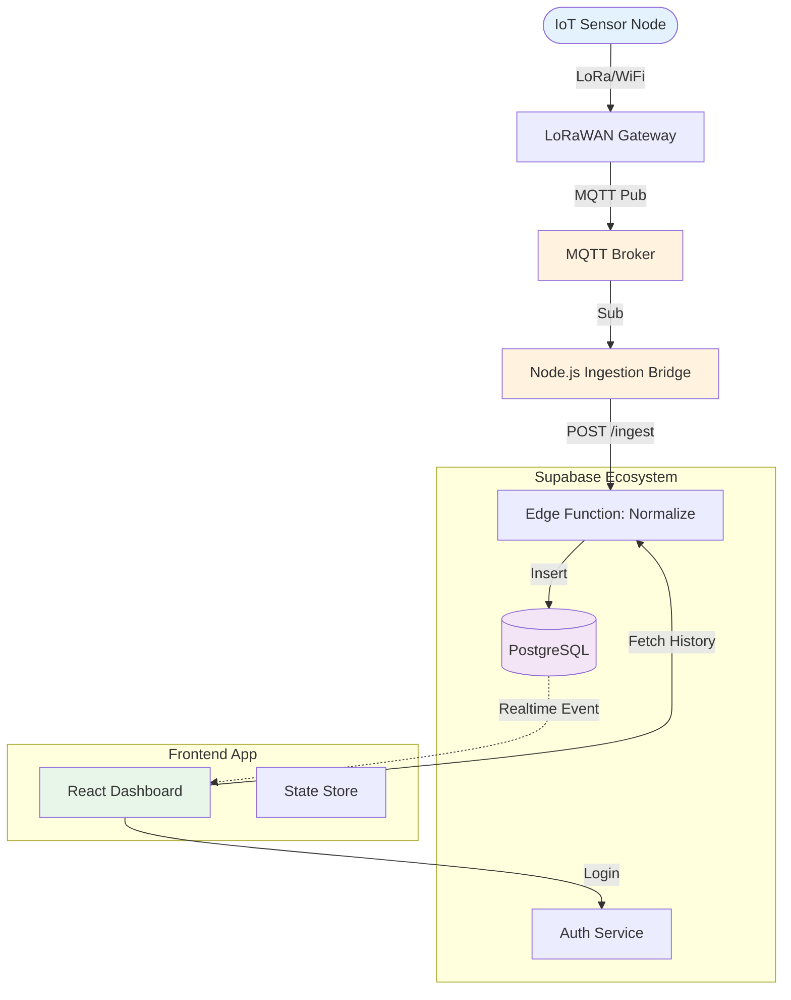

# System Architecture

## High-Level Data Flow

The architecture is designed to decouple the **Ingestion Layer** (high volume, fast writes) from the **Application Layer** (complex reads, user interaction).



## Component Layers

### 1. Device Layer
**Sensors** collect environmental data (soil moisture, temperature, battery level) and publish to MQTT broker via:
- **LoRaWAN:** Long-range, low-power for remote areas
- **WiFi:** Higher bandwidth for on-farm deployments
- **Cellular (4G/LTE):** Backup connectivity

**MQTT Topics:**
```
swamp/devices/{deviceId}/telemetry    # Sensor data
swamp/devices/{deviceId}/status       # Heartbeat/online status
swamp/devices/{deviceId}/config       # Configuration updates (cloud → device)
```

### 2. Ingestion Layer
**MQTT Broker** (HiveMQ/Mosquitto):
- Handles 1000+ concurrent connections
- QoS 1 (at least once delivery)
- TLS encryption with client certificates

**Node.js Bridge Service:**
- Subscribes to all device topics
- Validates message format
- Batches writes (5-second window)
- Forwards to Supabase Edge Functions

### 3. Backend Layer (Supabase)
**PostgreSQL 15:**
- Time-series telemetry data (partitioned by month)
- Row Level Security for multi-tenancy
- Triggers for alert generation

**Edge Functions (Deno):**
- `/api/ingest` - Receive data from MQTT bridge
- `/api/devices` - Device management CRUD
- `/api/telemetry` - Query historical data
- `/api/alerts` - Alert management

**Auth Service (GoTrue):**
- JWT-based authentication
- Email/password + OAuth
- Role-based access control

### 4. Frontend Layer
**React 18 + Vite:**
- Fast build times (<2s)
- Hot module replacement
- TypeScript for type safety

**Zustand State Management:**
- Lightweight (3KB vs Redux 45KB)
- No context/provider boilerplate
- Selective subscriptions

---

*This architecture supports 1000+ devices with <500ms latency.*
