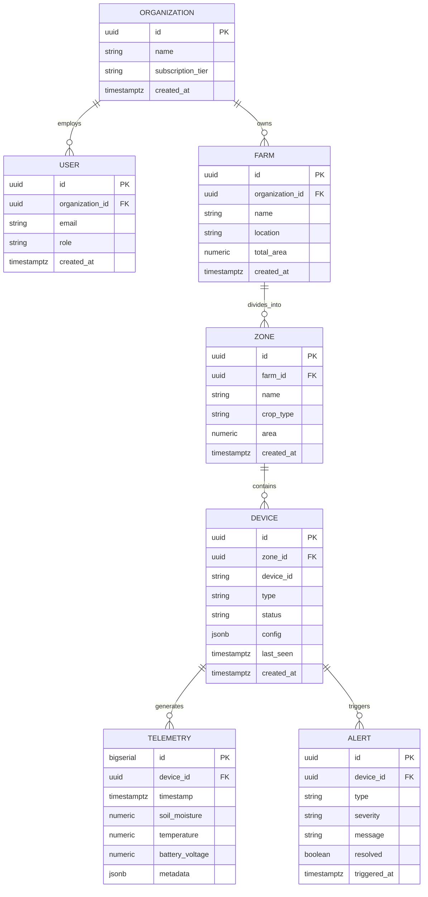

# Database Schema & Security

SWAMP uses **PostgreSQL 15** on Supabase. The schema is designed for multi-tenancy with Row Level Security.

## Entity Relationship Diagram



## Core Tables

### Organizations
```sql
CREATE TABLE organizations (
  id UUID PRIMARY KEY DEFAULT gen_random_uuid(),
  name TEXT NOT NULL,
  subscription_tier TEXT DEFAULT 'basic',
  created_at TIMESTAMPTZ DEFAULT NOW()
);
```

### Users
```sql
CREATE TABLE users (
  id UUID PRIMARY KEY REFERENCES auth.users(id),
  organization_id UUID REFERENCES organizations(id),
  email TEXT UNIQUE NOT NULL,
  role TEXT DEFAULT 'viewer',
  created_at TIMESTAMPTZ DEFAULT NOW()
);
```

### Telemetry (Partitioned)
```sql
CREATE TABLE telemetry (
  id BIGSERIAL,
  device_id UUID NOT NULL,
  timestamp TIMESTAMPTZ DEFAULT NOW(),
  soil_moisture NUMERIC,
  temperature NUMERIC,
  battery_voltage NUMERIC,
  metadata JSONB
) PARTITION BY RANGE (timestamp);

-- Monthly partitions
CREATE TABLE telemetry_2025_12 PARTITION OF telemetry
FOR VALUES FROM ('2025-12-01') TO ('2026-01-01');
```

## Row Level Security

```sql
-- Enable RLS
ALTER TABLE telemetry ENABLE ROW LEVEL SECURITY;

-- Policy: Users see only their organization's data
CREATE POLICY "org_isolation" ON telemetry
FOR SELECT USING (
  device_id IN (
    SELECT d.id FROM devices d
    JOIN zones z ON d.zone_id = z.id
    JOIN farms f ON z.farm_id = f.id
    WHERE f.organization_id = auth.user_organization_id()
  )
);
```

## Indexes

```sql
-- Composite index for time-range queries
CREATE INDEX idx_telemetry_device_time 
ON telemetry(device_id, timestamp DESC);

-- GIN index for JSONB metadata
CREATE INDEX idx_telemetry_metadata 
ON telemetry USING GIN(metadata);
```

---

*Schema designed for 10M+ rows with partition pruning.*
