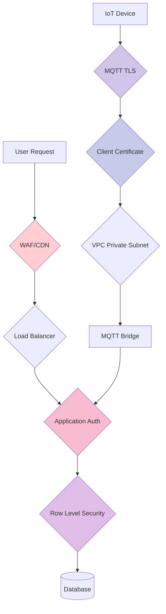
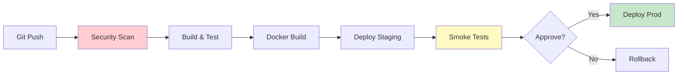

# Security & DevOps

This document outlines the security architecture and DevOps practices for the SWAMP platform.

## Security Model

### Defense in Depth Strategy



### Authentication & Authorization

#### User Authentication (Supabase Auth)
- **JWT-based authentication** with short-lived tokens (1 hour)
- **Refresh tokens** for session management (30 days)
- **Email + password** with bcrypt hashing
- **OAuth providers** supported (Google, GitHub)
- **MFA support** via TOTP

```typescript
// Token structure
interface JWTPayload {
  sub: string;           // User ID
  email: string;
  role: string;          // 'admin' | 'user' | 'viewer'
  aud: string;           // 'authenticated'
  exp: number;           // Expiration timestamp
  iat: number;           // Issued at timestamp
}
```

#### IoT Device Authentication
- **MQTT TLS 1.3** with client certificates
- **Device-specific credentials** (username/password per device)
- **Certificate rotation** every 90 days
- **Revocation list** for compromised devices

### Row Level Security (RLS)

PostgreSQL RLS ensures tenant isolation:

```sql
-- Example RLS policy for telemetry table
CREATE POLICY "Users can only view their organization's data"
ON telemetry
FOR SELECT
USING (
  device_id IN (
    SELECT d.id FROM devices d
    JOIN farms f ON d.farm_id = f.id
    JOIN organizations o ON f.organization_id = o.id
    JOIN users u ON u.organization_id = o.id
    WHERE u.id = auth.uid()
  )
);

-- Policy for insert (devices can only insert their own data)
CREATE POLICY "Devices can insert their own telemetry"
ON telemetry
FOR INSERT
WITH CHECK (
  device_id = current_setting('app.device_id')::uuid
);
```

### Network Security

#### VPC Architecture
- **Public subnets:** Load balancers, NAT gateways
- **Private subnets:** ECS tasks, application servers
- **No direct internet access** for application servers
- **Security groups:** Least privilege access

```hcl
# Security group rules (sanitized)
resource "aws_security_group" "ecs_tasks" {
  # Allow inbound only from ALB
  ingress {
    from_port       = 3000
    to_port         = 3000
    protocol        = "tcp"
    security_groups = [aws_security_group.alb.id]
  }
  
  # Allow outbound to Supabase (HTTPS)
  egress {
    from_port   = 443
    to_port     = 443
    protocol    = "tcp"
    cidr_blocks = ["0.0.0.0/0"]
  }
}
```

#### TLS/SSL
- **TLS 1.3** minimum version
- **HSTS enabled** (Strict-Transport-Security)
- **Certificate pinning** for mobile apps
- **Let's Encrypt** for automatic certificate renewal

### Data Protection

#### Encryption at Rest
- **PostgreSQL:** AES-256 encryption (Supabase managed)
- **S3 buckets:** Server-side encryption (SSE-S3)
- **EBS volumes:** Encrypted with KMS

#### Encryption in Transit
- **HTTPS only** for all API traffic
- **MQTT over TLS** for sensor communication
- **WebSocket Secure (WSS)** for real-time updates

#### Sensitive Data Handling
- **No PII in logs**
- **Secrets in AWS Secrets Manager** (not environment variables)
- **API keys rotated** every 90 days
- **Database credentials** never in code

### Security Scanning

#### Static Analysis (SAST)
```yaml
# Gitleaks configuration
[[rules]]
id = "api-key-pattern"
description = "Detect API keys"
regex = '''(?i)(api[_-]?key|apikey)['"]\s*[:=]\s*['"][0-9a-zA-Z]{32,}['"]'''
```

#### Dependency Scanning
- **Trivy** scans Docker images for CVEs
- **npm audit** for JavaScript dependencies
- **Safety** for Python dependencies
- **OWASP Dependency Check** in CI pipeline

#### Container Security
```yaml
# Trivy scan in CI
- name: Scan Docker image
  uses: aquasecurity/trivy-action@master
  with:
    scan-type: 'image'
    severity: 'CRITICAL,HIGH'
    exit-code: '1'  # Fail build on vulnerabilities
```

### Compliance & Auditing

#### Audit Logging
- **All API requests** logged with user ID, timestamp, action
- **Database changes** tracked with triggers
- **Authentication events** logged (login, logout, failed attempts)
- **Configuration changes** versioned in Git

```typescript
// Audit log entry structure
interface AuditLog {
  id: string;
  userId: string;
  action: string;           // 'create' | 'read' | 'update' | 'delete'
  resource: string;         // 'device' | 'farm' | 'user'
  resourceId: string;
  changes?: any;            // Before/after diff
  ipAddress: string;
  userAgent: string;
  timestamp: string;
}
```

#### Data Retention
- **Telemetry data:** 2 years (aggregated after 90 days)
- **Audit logs:** 7 years
- **User data:** Until account deletion + 30 days

---

## DevOps Practices

### CI/CD Pipeline

#### Pipeline Stages
1. **Security Scan** (Gitleaks, Trivy)
2. **Build & Test** (Unit tests, lint, type-check)
3. **Docker Build** (Multi-stage, scan image)
4. **Deploy to Staging** (Automated)
5. **Smoke Tests** (E2E health checks)
6. **Deploy to Production** (Manual approval)



#### Deployment Strategy
- **Blue-Green Deployment** for zero downtime
- **Canary releases** for high-risk changes
- **Rollback capability** within 5 minutes
- **Feature flags** for gradual rollout

```typescript
// Feature flag example
if (featureFlags.isEnabled('new-dashboard', userId)) {
  return <NewDashboard />;
} else {
  return <LegacyDashboard />;
}
```

### Infrastructure as Code (IaC)

#### Terraform Workflow
```bash
# Development workflow
terraform plan -var-file="staging.tfvars"
terraform apply -var-file="staging.tfvars"

# Production workflow (requires approval)
terraform plan -var-file="production.tfvars" -out=tfplan
# Manual review of plan
terraform apply tfplan
```

#### Resource Tagging
All infrastructure resources tagged:
```hcl
tags = {
  Environment = "production"
  Project     = "SWAMP"
  ManagedBy   = "Terraform"
  CostCenter  = "IoT-Platform"
  Owner       = "platform-team"
}
```

### Monitoring & Observability

#### Metrics (CloudWatch)
- **ECS Task CPU/Memory** usage
- **ALB 5XX error rate**
- **Database connection pool** utilization
- **MQTT message rate** (pub/sub)
- **API response time** (p50, p95, p99)

#### Alarms
```typescript
// Critical alarms (PagerDuty)
- ECS CPU > 80% for 5 minutes
- Database connections > 90%
- 5XX error rate > 1%
- MQTT bridge offline

// Warning alarms (Slack)
- API latency p95 > 500ms
- Disk usage > 70%
- Certificate expiry < 30 days
```

#### Logging Strategy
```json
// Structured logging format
{
  "timestamp": "2025-12-11T10:30:00Z",
  "level": "info",
  "service": "mqtt-bridge",
  "message": "Message received",
  "context": {
    "deviceId": "abc123",
    "topic": "swamp/devices/abc123/telemetry",
    "messageSize": 128
  },
  "traceId": "xyz789"
}
```

#### Distributed Tracing
- **Request ID** propagated across services
- **OpenTelemetry** for trace collection
- **X-Ray** for AWS service tracing

### Incident Response

#### On-Call Rotation
- **24/7 coverage** with PagerDuty
- **Primary and secondary** on-call engineers
- **Escalation policy** after 15 minutes

#### Incident Severity
- **P0 (Critical):** Platform down, data loss
- **P1 (High):** Major feature broken, performance degraded
- **P2 (Medium):** Minor feature broken, workaround available
- **P3 (Low):** Cosmetic issue, no user impact

#### Post-Incident Review
After every P0/P1 incident:
1. Timeline of events
2. Root cause analysis
3. Action items to prevent recurrence
4. Communication to stakeholders

### Disaster Recovery

#### Backup Strategy
- **Database:** Automated daily backups (7-day retention)
- **Point-in-time recovery** available (35 days)
- **Cross-region replication** for production

#### Recovery Time Objectives (RTO)
- **Database restore:** < 4 hours
- **Application redeploy:** < 30 minutes
- **Full disaster recovery:** < 8 hours

#### Recovery Point Objectives (RPO)
- **Database:** < 5 minutes (continuous backup)
- **Telemetry data:** < 1 minute (replicated)

---

## Security Checklist

Before deploying to production:

- [ ] All secrets in AWS Secrets Manager
- [ ] RLS policies tested for tenant isolation
- [ ] Security scan passed (no CRITICAL/HIGH vulns)
- [ ] HTTPS enforced (HSTS enabled)
- [ ] Rate limiting configured
- [ ] Audit logging enabled
- [ ] CloudWatch alarms configured
- [ ] Backup tested (restore verification)
- [ ] Incident response runbook updated
- [ ] Security review completed

---

*Security is everyone's responsibility. Report vulnerabilities immediately.*
